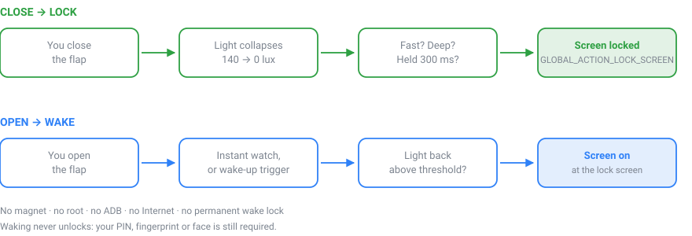

# FlipLock

**Fermez le rabat de votre coque portefeuille → l'écran s'éteint et le téléphone se verrouille.
Rouvrez-le → l'écran se rallume.**

Sans aimant, sans root, sans ADB, sans Shizuku, sans serveur, sans Internet.

*[🇬🇧 Read in English](README.md)*

<p align="center">
  
</p>

<p align="center">
  
</p>

L'application est disponible en **français, anglais et chinois simplifié** : elle suit la langue
du téléphone.

Les coques à rabat d'origine utilisent un aimant et un capteur Hall. Les coques tierces
bon marché n'ont pas d'aimant : Android ne sait donc pas qu'elles se ferment. FlipLock détecte
la fermeture à partir de la **chute de luminosité ambiante** — mais en cherchant un *événement*,
pas en comparant à un seuil fixe, pour ne pas verrouiller le téléphone dès qu'il fait sombre.

- Package : `com.fliplock.cover` · licence MIT
- `minSdk` 28 (version minimale exposant `GLOBAL_ACTION_LOCK_SCREEN`) · `targetSdk` / `compileSdk` 36
- Aucune permission Internet. Aucun analytics. Aucun serveur. 100 % local.

## Compatibilité

Rien dans le code n'est spécifique à un modèle : FlipLock lit `getSensorList(TYPE_ALL)` et
s'adapte à ce que l'appareil expose réellement. Il fonctionne sur tout Android 9+ doté d'un
capteur de luminosité en façade.

Développé et validé sur un **Samsung Galaxy (SM-S948B), Android 16 / One UI**, avec une coque
portefeuille tierce à rabat opaque **sans aimant**.

Ce dont vous avez besoin pour que ça marche :

| Élément | Pourquoi | Si absent |
|---|---|---|
| Capteur `TYPE_LIGHT` en façade | détecter la chute de lumière | l'app ne peut rien faire |
| Rabat **opaque** | la chute doit être franche | calibration classée « insuffisant » |
| Un capteur de mouvement **wake-up** | réveil à l'ouverture | verrouillage OK, réveil indisponible |

Un écran **Diagnostic** intégré vous dit exactement lequel de ces éléments manque sur *votre*
appareil, avec un bouton « Copier le diagnostic » qui produit un rapport technique complet
(modèle, version d'Android, liste des 45 capteurs, valeurs mesurées) — sans aucune donnée
personnelle. C'est le meilleur point de départ pour ouvrir une issue.

## Installation

Téléchargez l'APK depuis la page **[Releases](../../releases)**, puis :

1. ouvrez le fichier sur le téléphone → **Installer** ;
2. si Android demande d'autoriser la source, acceptez **pour cette application seulement** ;
3. ouvrez FlipLock → **Activer l'autorisation** → activez le service d'accessibilité ;
4. **Diagnostic capteurs** : vérifiez que les lux bougent quand vous fermez le rabat ;
5. **Calibrer ma coque** → **Appliquer ces réglages** ;
6. activez l'interrupteur FlipLock.

**One UI / Auto Blocker.** Si Samsung affiche « Paramètre restreint » au moment d'activer
l'accessibilité, utilisez le bouton **« Ouvrir Infos sur l'appli »** de l'écran d'accueil, puis
menu ⋮ → **Autoriser les paramètres restreints**. Ne désactivez pas Auto Blocker globalement.

**Mise en veille des applis.** *Paramètres → Batterie → Limites d'utilisation en arrière-plan →
Applis jamais mises en veille* → ajoutez FlipLock, sinon One UI peut tuer le service au bout de
quelques jours.

---

## 1. Principe de détection

La détection repose sur `Sensor.TYPE_LIGHT` (lux). **Jamais** sur un simple `if (lux < X)`.

`CoverDetectionEngine` cherche un **événement de fermeture** :

| Critère | Rôle |
|---|---|
| `lux <= closedLuxThreshold` | l'obscurité est atteinte |
| dernière mesure claire < `fallWindowMs` (900 ms) | **vitesse** : une pièce qui s'assombrit lentement est rejetée |
| baseline ≥ `minBaselineLux` (8 lux) et ≥ 2 échantillons | **pièce sombre** : la lumière seule ne peut pas trancher → refus |
| `baseline - lux >= minimumAbsoluteDropLux` (5 lux) | chute absolue |
| `drop% >= minimumDropPercent` (85 %) | chute relative |
| maintenu `confirmationDurationMs` (300 ms) | **durée** : main passée devant, ombre, artefact → rejetés |
| `cooldownMs` (1500 ms) après verrouillage | pas de déclenchements en rafale |
| `PowerManager.isInteractive` | jamais de verrouillage écran déjà éteint |

La **baseline** est une médiane glissante (3 s) alimentée uniquement par les mesures *claires*
et gelée dès qu'une candidature démarre. L'hystérésis (`releaseLuxThreshold = seuil × 2,5 + 1`)
annule la candidature dès que la lumière revient.

**Stratégies** — `AUTO` (défaut), `LIGHT_ONLY`, `LIGHT_PLUS_PROXIMITY`.
En `AUTO`, la proximité n'intervient **que** si la pièce est trop sombre pour que la lumière
tranche, **et** si le capteur produit réellement des événements (testé dynamiquement, jamais supposé).

## 2. Architecture

```
com.fliplock.cover
├── FlipLockApp.kt              Application + AppGraph (3 singletons, aucune lib d'injection)
├── MainActivity.kt             ComponentActivity + Compose
├── detection/
│   ├── DetectionModels.kt      DetectionConfig, DetectionStrategy, EngineSnapshot, DetectionEvent
│   └── CoverDetectionEngine.kt 100 % Kotlin/JVM, aucun import Android → testable
├── sensors/
│   ├── SensorModels.kt         LightSample, ProximitySample, SensorDescriptor, SensorProbeResult
│   └── SensorRepository.kt     SensorEventListener + Flow + sondage réel des capteurs
├── service/
│   ├── FlipLockAccessibilityService.kt   surveillance + performGlobalAction(LOCK_SCREEN)
│   ├── FlipLockForegroundService.kt      OPTIONNEL, désactivé par défaut
│   ├── ScreenStateMonitor.kt             ACTION_SCREEN_ON / OFF
│   └── AccessibilityStatus.kt            détection d'activation + ouverture des réglages
├── data/                       FlipLockSettings + SettingsRepository (DataStore)
├── calibration/                CalibrationManager (stats, seuils calculés, test obscurité)
├── diagnostic/                 DiagnosticRepository + DiagnosticReportBuilder
├── log/                        FlipLockLogger (tampon circulaire en mémoire)
├── runtime/                    FlipLockRuntime (état partagé activité ↔ service)
└── ui/                         Compose : Home, Diagnostic, Calibration, Avancé, Infos techniques
```

**La détection physique est séparée de l'action de verrouillage** : le moteur émet
`DetectionEvent.LockRequested`, le service exécute `performGlobalAction`.

## 3. Service d'accessibilité — privilèges minimaux

`res/xml/accessibility_service_config.xml` :

- `accessibilityEventTypes` **non déclaré** → vaut 0 → le service ne reçoit **aucun** événement ;
- `canRetrieveWindowContent="false"` → impossible de lire le contenu des fenêtres ;
- `canPerformGestures="false"`, `canRequestFilterKeyEvents="false"`, `notificationTimeout="0"`.

Une seule API du système est utilisée : `performGlobalAction(GLOBAL_ACTION_LOCK_SCREEN)`.

## 4. Arrière-plan et batterie

L'application ne crée **pas** de service supplémentaire : le service d'accessibilité — déjà
autorisé par l'utilisateur — porte lui-même la surveillance des capteurs.

- aucun `while(true)`, aucun polling, aucun `WakeLock` ;
- `SensorEventListener` uniquement, à `SENSOR_DELAY_GAME` ;
- listeners **retirés** dès que l'écran s'éteint ou que FlipLock est désactivé ;
- le ticker 50 ms ne tourne que **pendant une candidature** (quelques centaines de ms). Il est
  nécessaire parce que `TYPE_LIGHT` est un capteur « on-change » : arrivé à 0 lux il cesse d'émettre.

Un **service de premier plan optionnel** (`specialUse`, **désactivé par défaut**) est fourni dans
les réglages avancés. Il ne lit aucun capteur : il maintient seulement le processus en état
foreground, au cas où One UI couperait les capteurs en arrière-plan. À n'activer que si le TEST C échoue.

## 4 bis. Réveil à l'ouverture (optionnel, désactivé par défaut)

Le sens inverse : rabat ouvert → l'écran s'allume. `service/WakeOnOpenController.kt`.

**Le problème** : écran éteint, le SoC suspend. Le capteur `TYPE_LIGHT` est déclaré `Non-wakeup`
sur le S26 Ultra — ses événements sont mis en tampon par le sensor hub et **ne réveillent pas le
processeur**. L'écouter en continu exigerait un WakeLock permanent : exclu.

**La solution**, en deux phases complémentaires, sans WakeLock permanent. Elle s'arme quand
l'écran s'éteint **et** que le rabat était détecté fermé.

**Phase 1 — veille instantanée (60 s par défaut, réglable 0–300 s).** WakeLock **partiel**
(écran éteint) borné par `acquire(timeout)` + écoute directe de la lumière. C'est le seul moyen
de faire parler un capteur `Non-wakeup`, et ça couvre le cas « je ferme puis je rouvre tout de
suite, téléphone en main ». Coût mesuré : empêcher la suspension du SoC ≈ 50 mW, soit ≈ 0,004 %
de batterie par verrouillage pour 60 s.

**Phase 2 — déclencheurs matériels seuls, coût nul.** Capteurs wake-up à ≈ 0,001 mA
(`android.sensor.tilt_detector`, `com.samsung.sensor.wake_up_motion`,
`android.sensor.pick_up_gesture`, `android.sensor.significant_motion`). Ils réagissent au fait de
**reprendre** le téléphone après une période de repos — `Pick Up Gesture` exige une transition
repos → soulèvement, il ne peut donc pas couvrir la phase 1 à lui seul. Sur déclenchement :
WakeLock partiel ≤ 2,5 s + écoute de la lumière ≤ 1,5 s.

Dans les deux phases, le seuil est **adaptatif** :
`max(seuilFermeture × 1,5 ; 15 ; luxMesuréAuVerrouillage × 3 + 10)`. Le dernier terme évite un
faux réveil en plein soleil, où la fuite de lumière sous le rabat peut dépasser le seuil nominal.

Les capteurs `REPORTING_MODE_ONE_SHOT` sont armés via `requestTriggerSensor()` et ré-armés après
chaque déclenchement ; les `SPECIAL_TRIGGER` via `registerListener()`. Les constantes
`TYPE_TILT_DETECTOR` / `TYPE_PICK_UP_GESTURE` étant masquées dans le SDK public, la recherche se
fait par `stringType`.

Allumage : WakeLock `SCREEN_BRIGHT_WAKE_LOCK | ACQUIRE_CAUSES_WAKEUP` de 3 s ; si l'écran n'est
toujours pas interactif 500 ms plus tard, repli sur `WakeUpActivity` (`setTurnScreenOn`, API
officielle). Les deux chemins sont tracés dans le journal. **Aucun déverrouillage** : l'écran
s'allume sur l'écran de verrouillage.

Deux garde-fous : le réveil ne s'arme **que** si l'écran s'est éteint alors que le rabat était
fermé (sinon un téléphone posé sur un bureau se rallumerait au moindre mouvement) ; et dans une
pièce noire, ouvrir le rabat ne change pas la luminosité — l'écran ne s'allume pas.

## 5. Confidentialité

Permissions déclarées (vérifiées dans l'APK) :

```
android.permission.FOREGROUND_SERVICE
android.permission.FOREGROUND_SERVICE_SPECIAL_USE
android.permission.POST_NOTIFICATIONS
android.permission.WAKE_LOCK
com.fliplock.cover.DYNAMIC_RECEIVER_NOT_EXPORTED_PERMISSION   (auto, signature, interne à l'app)
```

Les trois premières servent uniquement au service persistant optionnel ; `WAKE_LOCK` (permission
« normale », sans boîte de dialogue) uniquement au réveil à l'ouverture, lui aussi désactivé par
défaut. La dernière est ajoutée automatiquement par AndroidX pour
`registerReceiver(..., RECEIVER_NOT_EXPORTED)` ; c'est une permission de signature privée à
l'application.

**Absentes** : INTERNET, caméra, micro, contacts, SMS, téléphone, localisation, fichiers/photos,
comptes, Bluetooth. Aucun analytics, Firebase, Crashlytics, tracking, publicité, API distante,
télémétrie, compte utilisateur ni serveur. `allowBackup="false"` + règles d'extraction excluant
tous les domaines : aucune donnée ne quitte le téléphone.

## 6. Dépendances

| Dépendance | Rôle |
|---|---|
| `com.android.application` 8.11.1 (AGP) | plugin de build Android |
| `org.jetbrains.kotlin.android` 2.1.21 | compilateur Kotlin |
| `org.jetbrains.kotlin.plugin.compose` 2.1.21 | compilateur Compose (obligatoire avec Kotlin 2.x) |
| `androidx.core:core-ktx` 1.16.0 | `ContextCompat.registerReceiver`, `NotificationCompat`, `ServiceCompat` |
| `androidx.lifecycle:lifecycle-runtime-ktx` 2.9.1 | `viewModelScope`, coroutines liées au cycle de vie |
| `androidx.lifecycle:lifecycle-runtime-compose` 2.9.1 | `collectAsStateWithLifecycle`, `LocalLifecycleOwner` |
| `androidx.lifecycle:lifecycle-viewmodel-compose` 2.9.1 | `viewModel()` dans Compose |
| `androidx.activity:activity-compose` 1.10.1 | `setContent`, `enableEdgeToEdge`, `BackHandler`, demande de permission |
| `androidx.compose:compose-bom` 2025.06.01 | aligne les versions Compose |
| `androidx.compose.ui:ui` / `ui-graphics` | primitives Compose |
| `androidx.compose.material3:material3` | Material 3 + couleurs dynamiques One UI |
| `androidx.datastore:datastore-preferences` 1.1.7 | persistance locale des réglages |
| `junit:junit` 4.13.2 (test) | tests unitaires du moteur |

Toutes proviennent de Google/JetBrains. Aucune dépendance tierce ou obscure.
`kotlinx-coroutines` arrive transitivement via AndroidX.

## 7. Tests unitaires

`app/src/test/java/com/fliplock/cover/detection/CoverDetectionEngineTest.kt` — 13 tests, tous verts :

```
gradlew.bat testDebugUnitTest
```

Couvre les 6 cas du cahier des charges (chute brutale, baisse progressive, pièce sombre,
artefact 50 ms, obscurité > 300 ms, cooldown) plus : extinction lente jusqu'au noir, pièce sombre
+ proximité en mode hybride, écran déjà éteint, FlipLock désactivé, main devant le capteur,
mode lumière seule ignorant la proximité, contenu du snapshot.

## 8. Compilation

Prérequis : JDK 17+ et le SDK Android (platform 36, build-tools 36.1.0). Le wrapper Gradle
télécharge le reste.

```
./gradlew testDebugUnitTest    # tests du moteur de détection
./gradlew assembleDebug        # APK de développement
./gradlew assembleRelease      # APK distribuable (R8 : ~2 Mo)
```

### Signer un build release

Le build release est minifié par R8 et **doit être signé avec votre propre clé** :

```bash
keytool -genkeypair -v -keystore fliplock-release.jks \
        -keyalg RSA -keysize 4096 -validity 10000 -alias fliplock
cp keystore.properties.example keystore.properties   # puis renseignez vos mots de passe
./gradlew assembleRelease
```

`keystore.properties` et `*.jks` sont dans `.gitignore` — **ne les versionnez jamais**.
Sans `keystore.properties`, le build produit `app-release-unsigned.apk`.

Ne distribuez pas d'APK *debug* : il porte `android:debuggable="true"` et est signé avec la clé
de débogage publique d'Android, partagée par tous les développeurs de la planète.

## 9. Contribuer

Le point d'entrée le plus utile est un **rapport de diagnostic** : Diagnostic capteurs →
« Sonder TOUS les capteurs » → « Copier le diagnostic », collé dans une issue. Il contient la
fiche complète de vos capteurs et les valeurs mesurées, ce qui permet de comprendre pourquoi la
détection échoue sur un appareil donné sans avoir à coder à l'aveugle.

Le moteur de détection (`CoverDetectionEngine`) est du Kotlin/JVM pur, sans aucun import
Android : toute modification de la logique doit venir avec un test dans
`CoverDetectionEngineTest`.

## 10. Ce projet n'ira pas sur le Play Store

Google interdit d'utiliser l'API d'accessibilité pour autre chose que de l'accessibilité.
FlipLock s'en sert pour verrouiller l'écran : la politique du Play Store le rejetterait, même
si l'usage est honnête, minimal et entièrement transparent pour l'utilisateur. La distribution
se fait donc par APK ici, ou via F-Droid / Obtainium.

C'est aussi pour cette raison que le service d'accessibilité est configuré au strict minimum
(cf. §3) : il n'a littéralement accès à rien d'autre qu'à l'action « verrouiller l'écran », et
le code est court exprès pour rester auditable.
