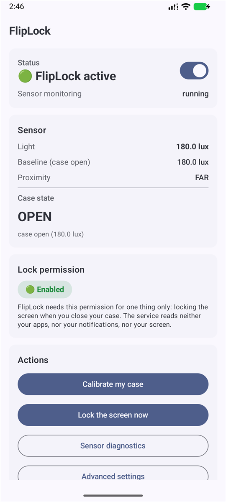
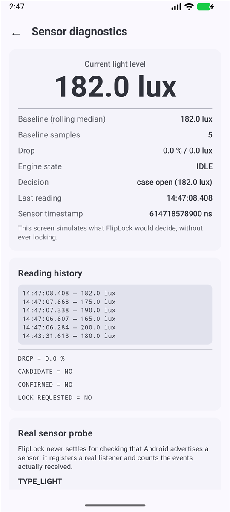
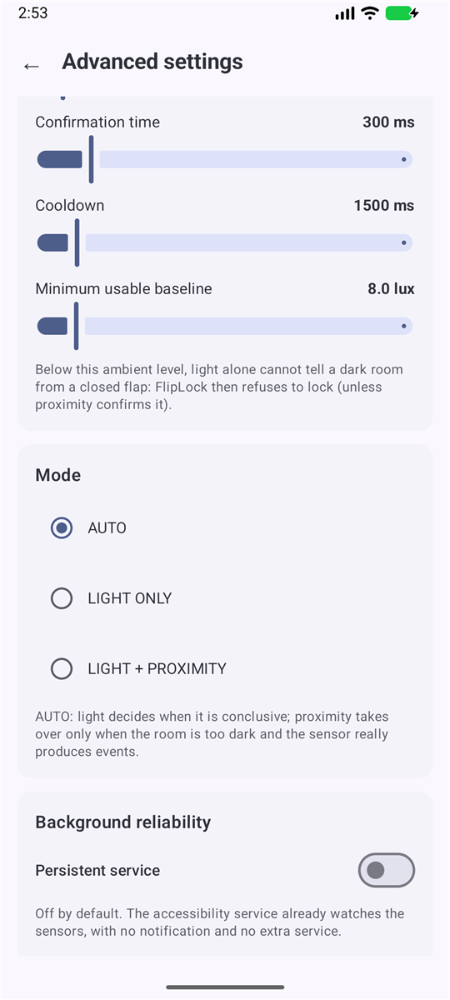
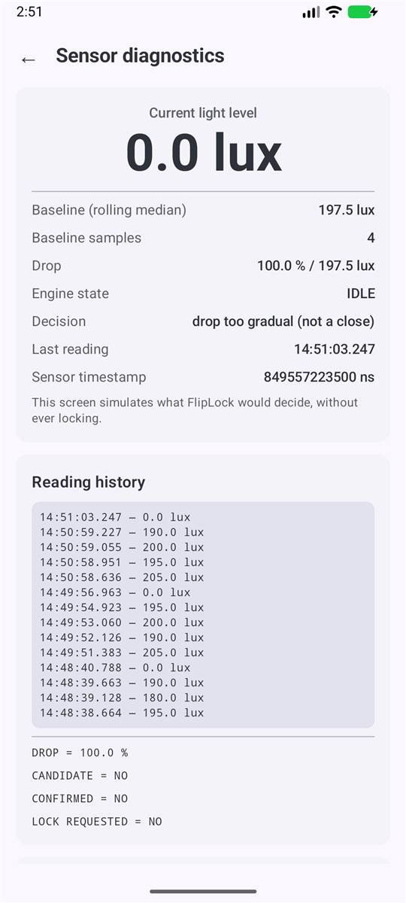

# FlipLock — 자석 없는 플립 케이스를 덮으면 화면을 잠급니다

**지갑형 / 플립 / 다이어리 케이스를 덮어도 화면이 꺼지지 않는 이유는 케이스에 자석이 없기 때문입니다.
FlipLock이 그 문제를 해결합니다.** 덮개를 닫으면 → 잠금. 덮개를 열면 → 화면이 다시 켜집니다.

자석 불필요, 루팅 불필요, ADB 불필요, Shizuku 불필요, 서버 없음, 인터넷 없음.

**[⬇ APK 내려받기](../../releases/latest)** · [FAQ (영문)](docs/FAQ.md)

**언어:** [English](README.md) · [Français](README.fr.md) · [简体中文](README.zh.md) · 한국어 · [日本語](README.ja.md)

<p align="center">
  
</p>

## 이런 문제를 겪고 계신가요?

정품이 아닌 플립 케이스를 샀는데:

- 덮개를 닫아도 **화면이 꺼지지 않습니다** — 가방 안에서 계속 켜져 있습니다
- 덮개를 열어도 **화면이 켜지지 않습니다**
- 삼성의 *스마트 커버* / *커버 화면* 설정이 아무 효과가 없거나, 아예 그 항목이 없습니다
- 화면이 꺼지지 않아 주머니 속에서 발열이 생기고 배터리가 빨리 닳습니다
- 찾은 앱들은 *두 번 탭해서 화면 끄기*만 제공하거나, 루팅 / ADB / Shizuku를 요구합니다
- “주머니 모드” 앱들은 **주변이 어두워질 때마다** 잠가버려서 오히려 더 불편합니다

**이유는 이렇습니다.** 정품 플립 커버 안에는 작은 **자석**이 들어 있고, 휴대폰에는 그것을 감지하는
**홀 센서**가 있습니다. 메커니즘은 이게 전부입니다. 서드파티 케이스에는 이 자석이 거의 없기 때문에
Android는 케이스가 닫혔다는 사실을 알 방법이 아예 없습니다. 감지할 신호 자체가 존재하지 않으니,
어떤 설정으로도 해결되지 않습니다.

**FlipLock은 다른 방법을 씁니다.** 휴대폰 앞면의 **조도 센서**를 감시합니다. 불투명한 덮개가 덮이면
조도가 급격히 무너집니다. FlipLock은 특정 lux 값이 아니라 그 **이벤트** — 빠르고, 깊고, 유지되는
하강 — 를 찾습니다. 이 차이가 핵심입니다. 어두운 방, 스쳐 지나가는 손, 해질녘, 실내로 들어가기는
모두 똑같이 낮은 조도로 끝나지만, 그중 어느 것도 잠금을 일으키지 않습니다.

<p align="center">
  
</p>

## 화면

| 홈 | 센서 진단 | 고급 설정 |
|:---:|:---:|:---:|
|  |  |  |

가장 중요한 화면은 엔진이 잠금을 **거부**하는 순간입니다:

<p align="center">
  
</p>

조도는 실제로 **0.0 lux**까지 떨어졌고, 하강폭도 실제로 **100 %**였습니다. 그런데도 FlipLock은
거부했습니다: `drop too gradual`(하강이 너무 완만함 — 닫힘이 아님). 마지막 밝은 측정값이 900밀리초보다
오래되었기 때문입니다. 이건 덮개가 내려온 게 아니라 방이 어두워진 것입니다. 바로 이 판단 하나가
하루 종일 휴대폰이 제멋대로 잠기는 것을 막아 줍니다.

## 잠금 조건

다음 조건을 **모두** 만족해야 잠급니다:

| 조건 | 목적 |
|---|---|
| `lux ≤ 닫힘 임계값` | 충분히 어두움 |
| 마지막 밝은 측정이 900밀리초 이내 | **속도** — 서서히 어두워지는 방은 배제 |
| 기준값 ≥ 최소 기준값, 표본 2개 이상 | **어두운 방** — 조도만으로 판단 불가하면 거부 |
| 절대 하강 ≥ 5 lux | 절대 폭 |
| 상대 하강 ≥ 85 % | 상대 폭 |
| 300밀리초 유지 | **지속 시간** — 손이나 그림자 배제 |
| 잠금 후 1500밀리초 대기 | 연속 발동 방지 |
| `PowerManager.isInteractive` | 이미 꺼진 화면은 건드리지 않음 |

## 설치

1. 휴대폰에서 APK를 열어 설치합니다. 출처 허용을 물으면 **이 앱에만** 허용하세요.
2. FlipLock을 열고 **권한 사용 설정**을 눌러 접근성 서비스를 켭니다.
3. **센서 진단**에서 덮개를 닫았을 때 lux 값이 움직이는지 확인합니다.
4. **내 케이스 보정하기** → **이 설정 적용**.
5. FlipLock 스위치를 켭니다.

**삼성 One UI.** *제한된 설정* 이라고 나오면, 홈 화면의 **“앱 정보” 열기** 버튼을 누른 뒤
오른쪽 위 ⋮ → **제한된 설정 허용**을 선택하세요. Auto Blocker를 통째로 끄지는 마세요.

또한 *설정 → 배터리 → 백그라운드 사용 제한 → 절대 잠자지 않는 앱*에 FlipLock을 추가하세요.
그렇지 않으면 One UI가 며칠 뒤 서비스를 종료시킬 수 있습니다.

## 개인정보

APK에 선언된 권한 (`aapt2 dump permissions`로 직접 확인 가능):

```
FOREGROUND_SERVICE, FOREGROUND_SERVICE_SPECIAL_USE, POST_NOTIFICATIONS, WAKE_LOCK
```

앞의 세 개는 선택 사항인 상시 실행 서비스에만, `WAKE_LOCK`은 선택 사항인 “열 때 화면 켜기”에만 쓰입니다.

인터넷, 카메라, 마이크, 연락처, SMS, 전화, 위치, 파일, 계정, 블루투스 권한은 **하나도 없습니다.**
분석 도구도, Firebase도, 텔레메트리도, 서버도, 클라우드 백업도 없습니다.
매니페스트에 `INTERNET` 권한 자체가 없으므로 이 앱은 물리적으로 네트워크 요청을 할 수 없습니다.

접근성 서비스는 극단적으로 제한되어 있습니다. `accessibilityEventTypes`를 **선언하지 않았고**
(기본값 0이므로 접근성 이벤트를 전혀 수신하지 않습니다), `canRetrieveWindowContent="false"`입니다.
호출하는 시스템 API는 단 하나, `performGlobalAction(GLOBAL_ACTION_LOCK_SCREEN)`입니다.

## 알려진 제약

- **완전한 어둠에서는 동작하지 않습니다.** 칠흑 같은 방에서는 덮개를 닫든 열든 모두 0 lux라
  판단할 정보가 없습니다. FlipLock은 추측하느니 아무것도 하지 않는 쪽을 택합니다.
- 근접 센서가 덮개에 반응하지 않는 기기라면 하이브리드 모드도 도움이 되지 않습니다.
  보정 결과가 이를 명확히 알려 줍니다.
- **Google Play에는 올라가지 않습니다.** 구글은 접근성 API를 접근성 외 용도로 쓰는 것을 금지합니다.
  Releases에서 APK를 받거나 Obtainium으로 업데이트를 추적하세요.

## 문제 신고

**센서 진단** → **모든 센서 실측** → **진단 정보 복사** 후
[새 이슈](../../issues/new)에 붙여넣어 주세요. 기기 모델, Android 버전, 모든 센서의 실측 결과와
측정값이 담기며, 개인정보는 포함되지 않습니다.

---

MIT 라이선스. 전체 기술 문서는 [English README](README.md)를 참고하세요.
